# SENTINEL — showcase

Full-resolution screenshots of the desktop app, generated by Playwright from the
in-browser mock bridge with **real seeded data** (no placeholders, no empty charts).
Regenerate with `just screenshots`. Both themes are captured for the dashboard and
vault; the rest are dark (the default).

## Desktop (dark)

| | |
|---|---|
| Onboarding — key ceremony | 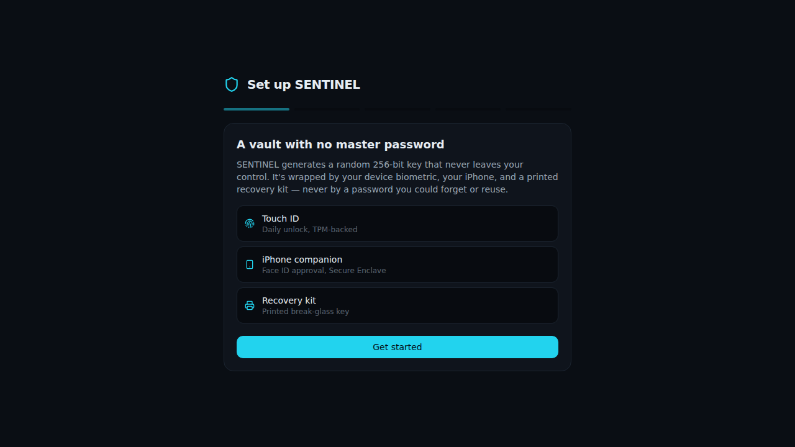 |
| Unlock — wrapper picker | 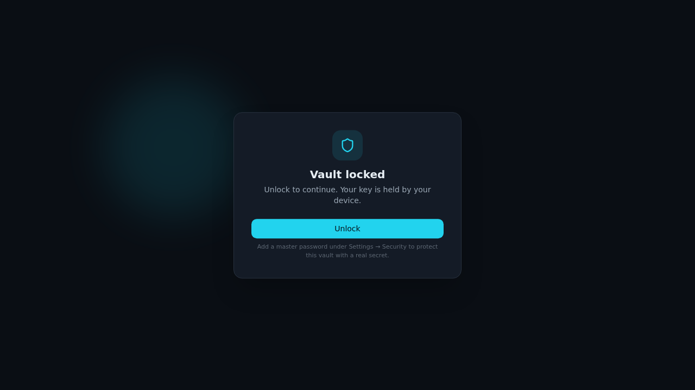 |
| Vault — list + detail | 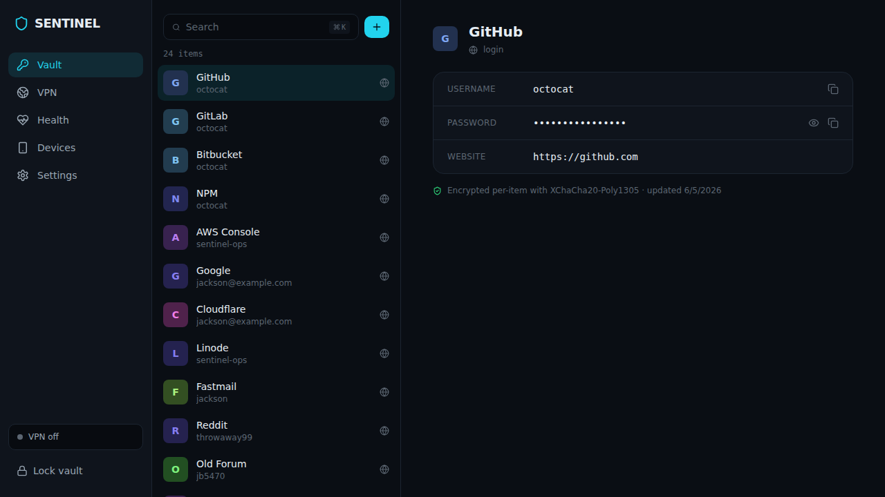 |
| Vault — item detail | 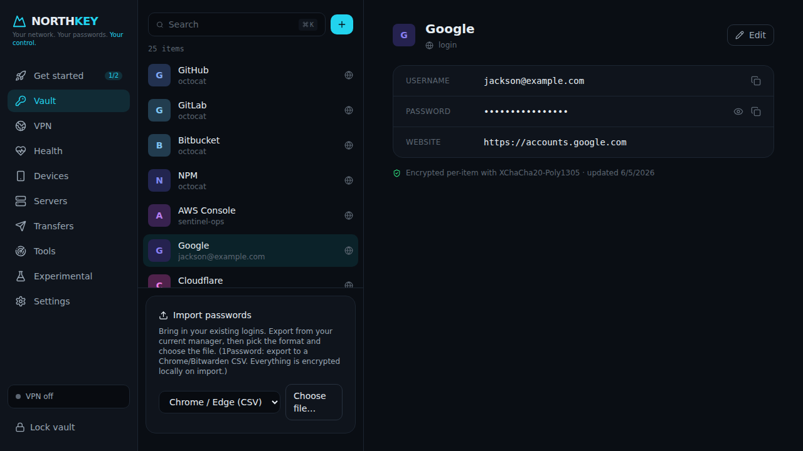 |
| VPN — region picker (idle) | 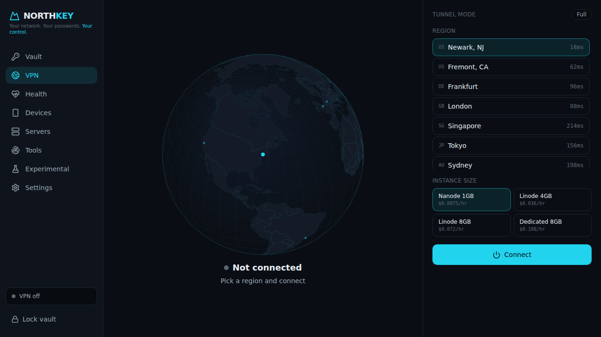 |
| VPN — connected (globe arc, live charts) | 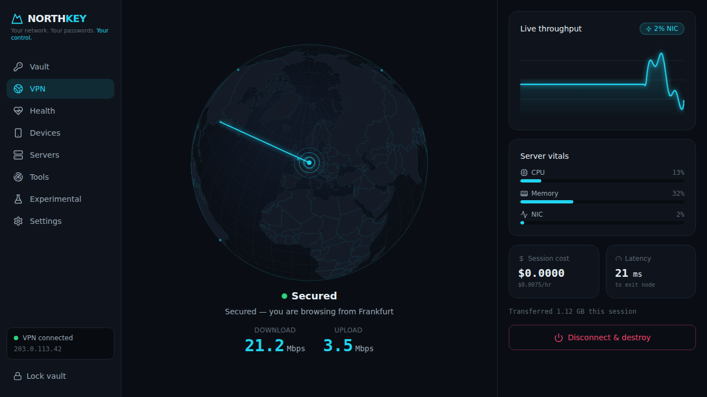 |
| Health — audit + generator | 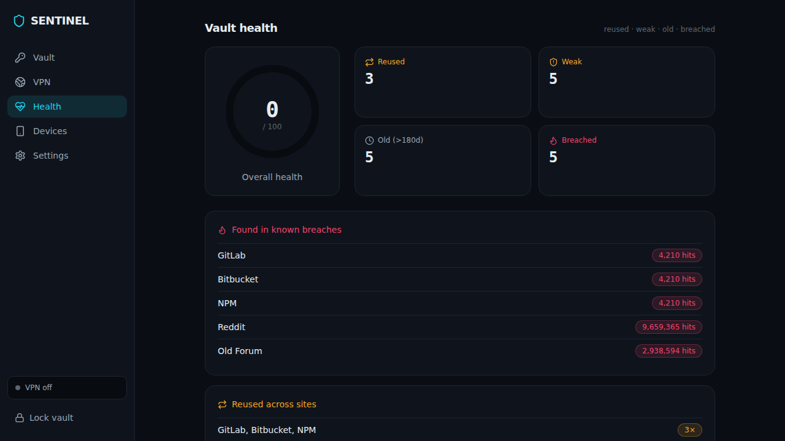 |
| Devices — pairing | 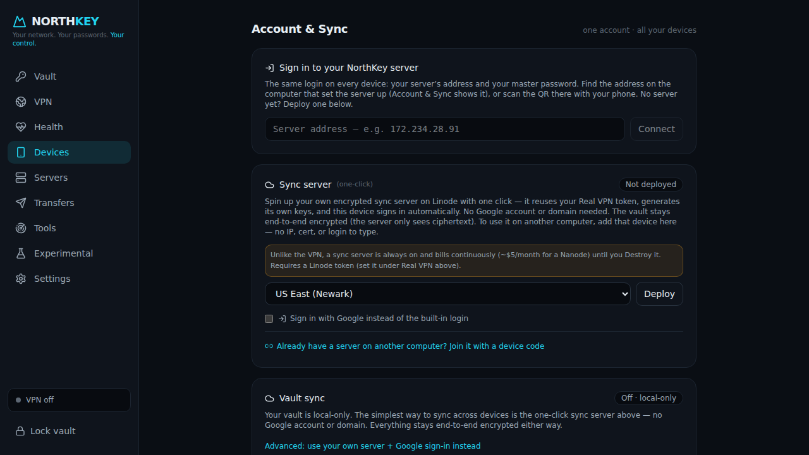 |
| Settings | 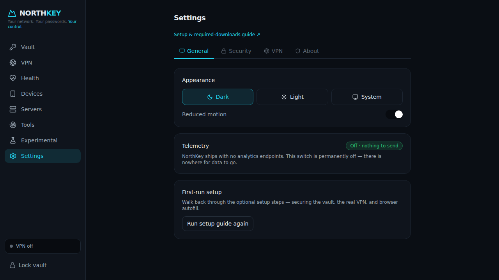 |
| Monthly report card | 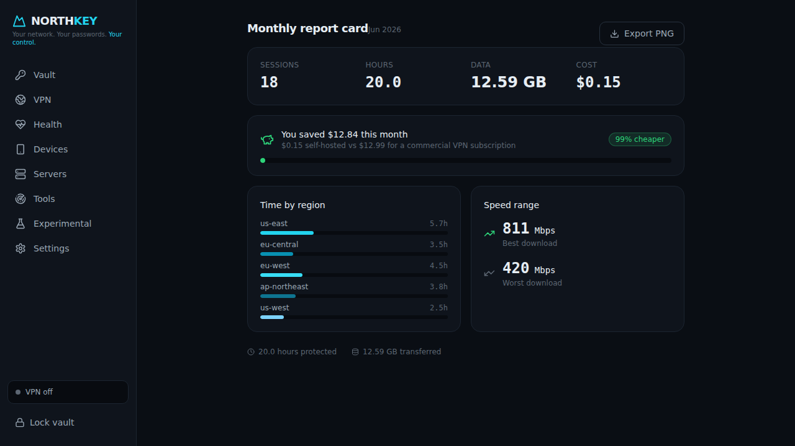 |

## Light theme

| | |
|---|---|
| Vault | 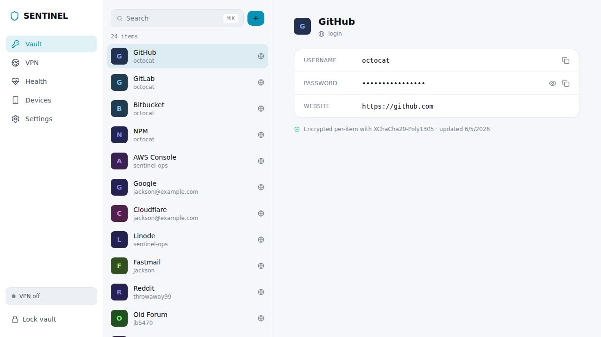 |
| VPN — connected | 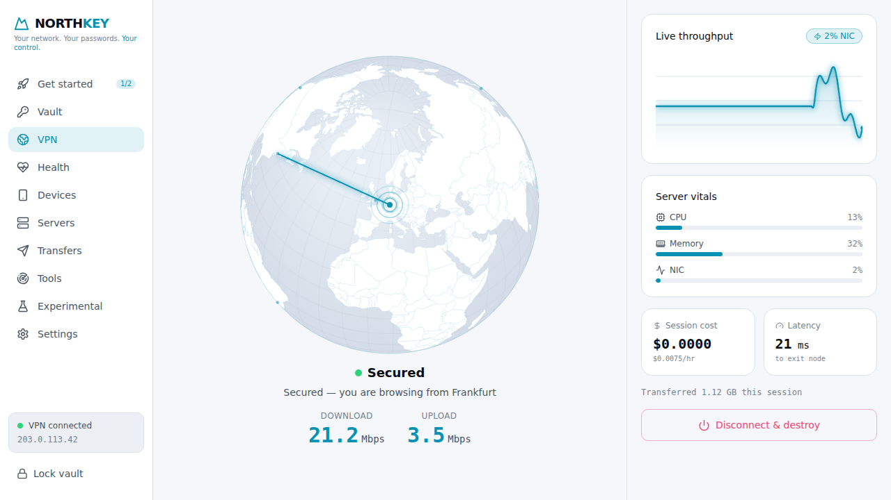 |

## Signature moments

- **Connect sequence** — the globe rotates to the chosen region and an animated
  great-circle arc + pulse travels from your location while the UI narrates
  "Provisioning in Frankfurt… Handshaking… Secured" (see `vpn-connected.png`). The globe
  is a 2D-canvas d3-geo orthographic projection — no WebGL, so it screenshots pixel-stably.
- **Live throughput** — a 60fps glow-stroke area chart with animated up/down odometers.
- **Vault** — command-palette-first (Cmd-K), passwords hidden by default with a reveal
  and a copy-with-countdown-ring.

> The Chrome extension and iOS companion ship as source; their UIs are described in
> `apps/extension` and `apps/ios-key`. The desktop screenshots above are the primary
> visual deliverable.
